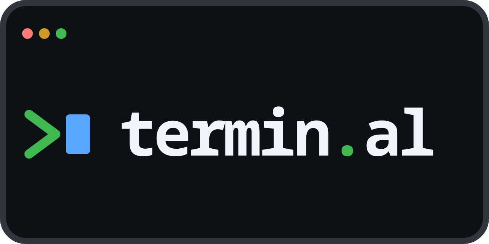

  
  
<strong>A portfolio that behaves like a terminal.</strong>

  

    Explore projects, writing, notes, activity, and more through a virtual shell built for the browser.
  

  

    
    
    
  

  

    <a href="#explore-the-terminal">Explore</a>
    &nbsp;&middot;&nbsp;
    <a href="docs/README.md">Documentation</a>
    &nbsp;&middot;&nbsp;
    <a href="CONTRIBUTING.md">Contribute</a>
  

---

## A portfolio with a command line

termin.al brings profile pages, projects, notes, blog posts, current activity,
changelog entries, and aggregate statistics into a terminal-inspired workspace.
Instead of navigating a conventional site, visitors discover content with
familiar commands, browse a virtual filesystem, and arrange independent shell
panes.

<table>
  <tr>
    <td width="50%" valign="top">
      <h3>Explore naturally</h3>
      
Use <code>ls</code>, <code>cd</code>, <code>find</code>, <code>cat</code>, <code>grep</code>, and other familiar tools against a portfolio-shaped virtual filesystem.

    </td>
    <td width="50%" valign="top">
      <h3>Read without leaving the terminal</h3>
      
Open Markdown pages and publications in built-in viewers, with syntax highlighting and maintained <code>man</code> pages close at hand.

    </td>
  </tr>
  <tr>
    <td width="50%" valign="top">
      <h3>Build a workspace</h3>
      
Split, focus, resize, zoom, swap, rotate, and lay out panes. Each shell keeps its own working directory and scrollback.

    </td>
    <td width="50%" valign="top">
      <h3>Publish in place</h3>
      
The owner can edit blog posts and notes in a practical Vim-style editor, preview assets, and publish back to GitHub without leaving the browser.

    </td>
  </tr>
</table>

## Explore the terminal

Start with `help`, then use `man <command>` whenever you want the maintained
manual for a command.

| Area | Commands |
| --- | --- |
| Portfolio | `about`, `skills`, `tools`, `projects`, `blog`, `notes`, `now`, `changelog`, `cv`, `stats` |
| Files and text | `pwd`, `cd`, `ls`, `tree`, `find`, `cat`, `head`, `tail`, `grep`, `sed`, `echo`, `rm` |
| Presentation | `open`, `less`, `man`, `help`, `history`, `clear`, `theme` |
| Identity and authoring | `login`, `logout`, `whoami`, `edit` |
| Workspace | `pane` |

The shell supports bounded pipelines, redirection, virtual-path globs, and
completion. Redirected files stay in a browser-persistent overlay; they never
touch a visitor's host filesystem. Pane layouts and pane-local state are
in-memory and reset when the page reloads. `pane split`, `focus`, `select`,
`resize`, `close`, `zoom`, `swap`, `rotate`, and `layout` shape the workspace;
`Ctrl+b` starts pane key bindings.

## Demo and live modes

- **Demo** (`/demo`) is a deterministic, self-contained way to explore the
  interface. It performs no OAuth, host, GitHub, or other external I/O and
  rejects writes.
- **Live** (`/`) connects the browser to the F# host for GitHub-backed content,
  sessions, protected CV access, aggregate statistics, and owner publication.

The supported experience is desktop-first. Narrow-screen controls provide
basic navigation, but mobile parity is not a product guarantee. The integrated
editor implements a useful Vim subset rather than attempting to be a complete
Vim emulator.

## Project documentation

- [Documentation guide](docs/README.md) — choose the right setup, content, host,
  deployment, or architecture guide.
- [Contributing](CONTRIBUTING.md) — development environment, checks, generated
  artifacts, and contribution expectations.
- [Content repository](docs/content-repository.md) — catalog, projects,
  publications, assets, and content limits.
- [Live host configuration](docs/live-configuration.md) — repositories,
  GitHub App permissions, authentication, CV access, and reverse proxies.
- [NixOS operations](docs/nixos-operations.md) — deployment, statistics state,
  health checks, backup, and restore.
- [Architecture and limits](docs/architecture-and-limits.md) — browser/host
  boundary, runtime modes, and deliberate non-goals.
